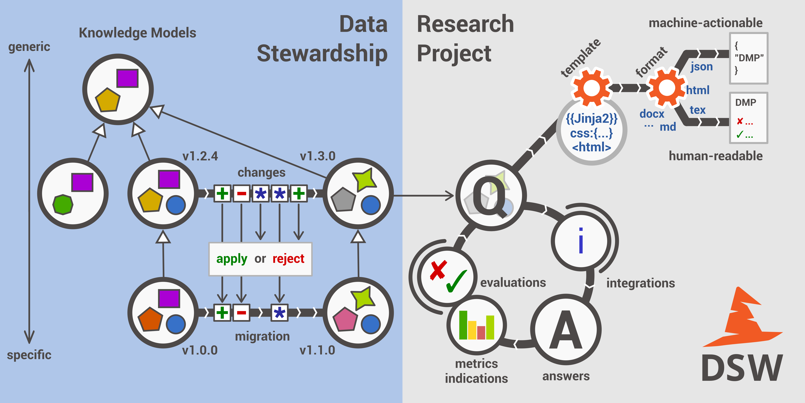

*********
About DSW
*********

What is DSW?
============

Data Stewardship Wizard is a joint `ELIXIR CZ <https://www.elixir-czech.cz>`_ and `ELIXIR NL <https://www.dtls.nl/elixir-nl/>`_ project bringing a simple but powerful solution for researchers to help them understand what is needed for good, FAIR-oriented Data Stewardship, to find ELIXIR experts to help out, and to build their own Data Management Plans. The DS Wizard can also function as a check list for data management professionals, like the checklists used by pilots before each flight.

FAIR
----

The main driver for the DSW is now to offer a convenient helpful tool for data stewards and researchers. Given a limited funding, we focus on this mission now. Howevever, from a long-term perspective, the richness of knowledge contained in the Wizard definitively calls for being FAIR. On this page we track the progress of compliance with the `FAIR principles <https://www.go-fair.org/fair-principles/>`_.

Machine-Actionable DMPs
-----------------------

We are part of the initiative `#activeDMPs <https://activedmps.org>`_. Here, we will post updates on concrete steps, mostly with the respect to the identified use cases. The work on this front will continue according to our available capacity and funding.

Terminology
===========

Concepts
--------

.. glossary::

  Organization
    An infrastructure, institution or a similar body that runs its own copy of DS Wizard. Identified by Organization ID.

  Knowledge Model (KM)
    An ordered collection of interlinked KM Items, from which a questionnaire is generated. Identified by a KM ID. May be customized and released as a package. Identified by a ID that consists of Organization ID, KM ID and Version. It can be exported/imported and further customized.

  Questionnaire
    A representation of a KM in a shape of a form for filling-in.

  Data Management Plan
    Exported filled questionnaire using selected template and format that should help researcher with data management in his/her project.

  KM Root
    A package with no ancestor packages.

  Customization of KM
    An ordered collection of changes of another parent knowledge model.

  KM Item
    A chapter, question, answer, reference, expert, integration, tag, etc.

  Change of KM Item
    Adding, editing, deleting of a knowledge item

  Migration of KM
    Upgrade of a KM with a newer version of the parent KM

Modules
-------

.. glossary::

  DS Wizard
    Our portal solution for Data Stewardship Planning. It contains :term:`Questionnaire`, :term:`KM Editor` and other parts for manamement of KMs and users.

  Questionnaire
    A tool for interactive browsing and answering a questionnare.

  KM Editor
    A tool for customization of a KM and its creation and publishing.

Learn More
==========

- `DS Wizard (landing page) <https://ds-wizard.org>`_
- `Leaflet <https://github.com/ds-wizard/dsw-leaflet>`_
- `Diagrams <https://github.com/ds-wizard/dsw-digram>`_
- ELIXIR All Hands 2018

  - `Poster <https://github.com/DataStewardshipWizard/dsw-common/raw/master/wiki-resources/DSW_AllHands18_Poster_v4.pdf>`_
  - `Flask Talk <https://github.com/DataStewardshipWizard/dsw-common/raw/master/wiki-resources/DSW_AllHands18_FlashTalk.pdf>`_

