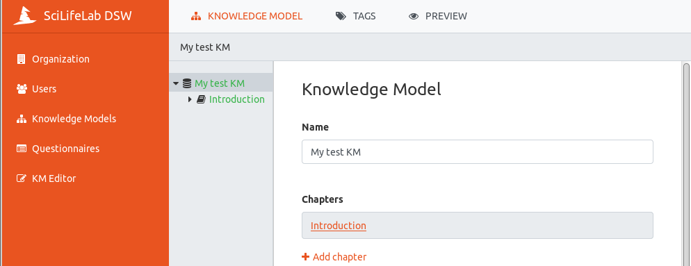

.. role:: red
	  :class: red
.. role:: green
	  :class: green

==================
KM Editor Tutorial
==================

The KM (Knowledge Model) Editor is used for creating and updating knowledge models. This tutorial will go through the steps of creating a new KM from scratch.

 1. Click on "KM Editor" in the left-hand menu of the wizard
 2. Click "Create" on the top to the right
 3. Fill the fields with appropriate **Name** (e.g. 'KM Editor Test Model') and **Knowledge Model ID** (e.g. 'test-model'). The ID can contain alphanumeric characters and dash but cannot start or end with dash. Leave Parent Knowledge model as is (--). *Note:* If you want to update or reuse an existing model, this is where you select which one.
 4. Click on "Save" button
 
Create a chapter
----------------

Once you have created a new KM, it's time to fill it with chapters (i.e. sections; think of them as headers of your model).

 1. Write a name of the KM (e.g. 'My test KM')
 2. Press :red:`+ Add chapter`
 3. Write a **Title** (e.g. 'Introduction') and **Text** (e.g. 'Background information') for the chapter. *Note:* The **Text** field is where you add a description of what the chapter will contain questions about. There are two tabs, 'Editor' and 'Preview', since you can use Markdown (https://www.markdownguide.org/basic-syntax/) to format the text and check the result in 'Preview'.
 4. Press :red:`+Add question` in order to create a question

    
Notice the grey area which gives an overview of your KM. Use this to navigate between the different parts. Whenever you want to see the result of an addition, click on another part in the KM overview (at this stage this would be the "parent" we named :green:`'My test KM'`.

	   
Add a question
--------------
Questions can be of different types:

* Options
* List of items
* Value

Let's create some questions of each type to demonstrate:

**Value**
 1. Select *Value* as **Question Type**
 2. Write 'Project title' in the **Title** field
 3. In the **Text** field, write 'Please enter the title of your project', as instructive text
 4. Use **When does this question become desirable?** to indicate in which phase of the project a question should be answered, e.g. *Before submitting the proposal*.
 5. **Value type** can be *String*, *Date*, *Number* or *Text*, select *Text*

**List of items**
 1. Click on :green:`Introduction` in the grey overview area of the editor
 2. Press :red:`+Add question` in order to create a new question
 3. Select *List of items* as **Question Type**
 4. Write 'Project members' as **Title**
 5. Write 'Please specify the researchers participating in the project' as **Text**
 6. Select *Before submitting the DMP* as **When does this question become desirable?**
 7. In the **Item Template**, click on :red:`+Add question`

    a. Set the **Question type** to *Value*
    b. Write 'Name' as **Title**
    c. Back to one level up by clicking on :green:`Project members` in the grey overview part of the editor
    d. Scroll down and click on :red:`+Add question` in the **Item Template**
    e. Set the **Question type** to *Value*
    f. Write 'Email' as **Title**

**Options**
 1. Click on :green:`Introduction` in the grey overview area of the editor
 2. Press :red:`+Add question` in order to create a new question
 3. Select *Options* as **Question Type**
 4. Write 'Research field' as **Title**
 5. Write 'Please select the research field for this project' as **Text**
 6. Click on :red:`+Add answer`
 7. Write 'Life science' as **Label** 
 8. Write 'Your project is likely going to produce a lot of data, a full data management plan will prepare you for the various challenges this will entail' as **Advice**
 9. Click on :green:`Research field` in the grey overview area, scroll down to **Answers** and click on :red:`+Add answer` 
 10. Write 'Other' as **Label**
 11. Scroll down to **Follow-up Questions** and click on :red:`+Add follow-upp question`
 12. Select *Value* as **Question Type**
 13. Write 'Which other research field?' as **Title**
 14. As **Value Type**, select *Text*

Save
----
Whenever there are changes not saved in the KM, the clickable options "Discard" and "Save" is visible in the top row of the wizard. Click on "Save".

Notice that this automatically lead you to the top level of the KM Editor, outside your KM. If you position the mouse on your KM ('Test of KM Editor') you see the options of :red:`Open Editor`, :red:`Publish` and :red:`Delete`. Click on :red:`Open Editor` in order to continue editing the KM.
 
Add Reference and Expert
------------------------
All question types have the possibility of adding references and experts, to be used for adding additional information and people to contact in order to get help, respectively. Let's add one of each:

 1. Click on the arrow at :green:`Research field` in the grey overview area, and scroll down to **References**
 2. Click on :red:`+Add reference`
 3. Write 'https://en.wikipedia.org/wiki/List_of_life_sciences' as **URL**
 4. Write 'List of Life sciences' as **Label**
 5. Click on :green:`Research field` again and then click on :red:`+Add reference`
 6. Write 'My science for life guru' as **Name**
 7. Write 'help@scilifeguru.com' as (the fake) **Email**
 8. Click on "Save" in top right corner, position the mouse on your KM ('Test of KM Editor'), and click on :red:`Open Editor`

Change order of questions
-------------------------
It is possible to rearrange the order of questions, if they are on the same 'level' (but not between levels at the moment of writing this tutorial). Let's try:

 1. Click on :green:`Introduction` and scroll down to **Questions**. The three questions created are all on the same level.
 2. Position the mouse on the grey area next to :red:`Research field`, hold down the left button of the mouse and drag-and-drop above :red:`Project title`

If and when the need arise to move a question to another level/group of questions, there are currently two alternatives:

 * Rewrite the question in the new position, or
 * `Export`_ the knowledge model and edit the resulting json file in an appropriate editor, and then import it again

Preview
-------
In order to see what the resulting questionnaire will look like, you can click on "PREVIEW" on top row of the wizard. When you are finished just klick on :red:`KNOWLEDGE MODEL` on the rop row, to return to editing mode.

Tags
----
Also on the top row of the wizard, is the "TAGS" viewer function. Tags can be used to mark questions of interest to certain stakeholders, when only a subset of the questions are of interest. We have not defined any tags yet, so let's do that:

 1. Click on :green:`'My test KM'` in the grey overview area, and scroll down to **Tags**
 2. Click on :red:`+ Add tag`
 3. Write 'Library' as **Name**
 4. Pick a color by clicking on one of the colored squares
 5. Expand :green:`Introduction` and click on :green:`Project title` in the grey overview area
 6. Scroll down to **Tags** and mark this question as of interest to the library by clicking the check box
 7. Do the same for :green:`Research field`
 8. Click on "PREVIEW" and notice that all questions are visible. Select the Library tag, by clicking in it's check box. Now only the two questions *Project title* and *Research field* are visible.

Publish
-------
When you are happy with the content and look of your KM, it is time to make it available for people to use it (either as a start for their own KM or for users to fill it out in form of so called Questionnaires):

 1. Click on "KM Editor" in the leftside menu
 2. Position the mouse on your KM ('Test of KM Editor') and click on :red:`Publish` among the alternatives that becomes visible
 3. Add a version number in **New version** (e.g. '1.0.0')
 4. Write a **Description** (e.g. 'This is the root version')
 5. Click on "Publish"

Export
------
A knowledge model kan be exported into a json formatted file:

 1. Click on "Knowledge Models" in the left hand menu
 2. Position your mouse on the KM ('Test of KM Editor') and click on :red:`View detail`
 3. Click on :red:`Export` and save the file on your computer.

Import
------
A knowledge model can also be imported:

 1. Click on "Knowledge Models" in the left hand menu
 2. Click on "Import" in top-right corner
 3. Click on "Choose file", select the .km-file
 4. Click on "Upload"

Note: If the KM already exists in the wizard it needs to be deleted first, both in the "KM Editor" (first) and in "Knowledge Models"

